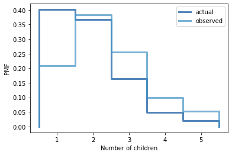

[Think Stats Chapter 3 Exercise 1](http://greenteapress.com/thinkstats2/html/thinkstats2004.html#toc31) (actual vs. biased)

## Exercises

**Exercise:** Something like the class size paradox appears if you survey children and ask how many children are in their family. Families with many children are more likely to appear in your sample, and families with no children have no chance to be in the sample.

Use the NSFG respondent variable `numkdhh` to construct the actual distribution for the number of children under 18 in the respondents' households.

Now compute the biased distribution we would see if we surveyed the children and asked them how many children under 18 (including themselves) are in their household.

Plot the actual and biased distributions, and compute their means.

## Solution


```python
from __future__ import print_function, division

%matplotlib inline

import numpy as np

import nsfg
import first
import thinkstats2
import thinkplot
```


```python
resp = nsfg.ReadFemResp()
```


```python
numkdhh = resp[resp.numkdhh>0].numkdhh # gonna analysis only family with kids
```


```python
pmf = thinkstats2.Pmf(numkdhh, label='actual')
```

This function computes the biased PMF we would get if we surveyed children and asked about the size of the household.


```python
def BiasPmf(pmf, label):
    new_pmf = pmf.Copy(label=label)

    for x, p in pmf.Items():
        new_pmf.Mult(x, x)
        
    new_pmf.Normalize()
    return new_pmf
```

The following graph shows the difference between the actual and observed distributions.


```python
biased_pmf = BiasPmf(pmf, label='observed')
thinkplot.PrePlot(2)
thinkplot.Pmfs([pmf, biased_pmf])
thinkplot.Config(xlabel='Number of children', ylabel='PMF')# Solution goes here
```


    

    


The observed mean is substantially higher than the actual.


```python
print('Actual mean', pmf.Mean())
print('Observed mean', biased_pmf.Mean())
```

    Actual mean 1.9186274509803922
    Observed mean 2.4036791006642817
