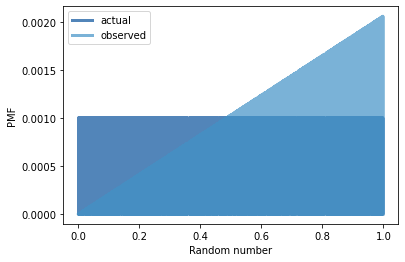
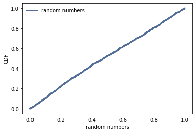

[Think Stats Chapter 4 Exercise 2](http://greenteapress.com/thinkstats2/html/thinkstats2005.html#toc41) (a random distribution)

## Exercises

**Exercise:** The numbers generated by `numpy.random.random` are supposed to be uniform between 0 and 1; that is, every value in the range should have the same probability.

Generate 1000 numbers from `numpy.random.random` and plot their PMF.  What goes wrong?

Now plot the CDF. Is the distribution uniform?

## Solution


```python
from __future__ import print_function, division

%matplotlib inline

import numpy as np

import nsfg
import first
import thinkstats2
import thinkplot
```

Generating 1000 numbers from numpy.random.random:


```python
rand = np.random.random(1000)
```

Finding PMF:


```python
pmf = thinkstats2.Pmf(rand, label='actual')
```


```python
def BiasPmf(pmf, label):
    new_pmf = pmf.Copy(label=label)

    for x, p in pmf.Items():
        new_pmf.Mult(x, x)
        
    new_pmf.Normalize()
    return new_pmf
```


```python
biased_pmf = BiasPmf(pmf, label='observed')
thinkplot.PrePlot(2)
thinkplot.Pmfs([pmf, biased_pmf])
thinkplot.Config(xlabel='Random number', ylabel='PMF')# Solution goes here
```


    

    


From PMF plot looks like higher number is more likely to get and disctibution isn't uniform

Finding CDF:


```python
def EvalCdf(sample, x):
    count = 0.0
    for value in sample:
        if value <= x:
            count += 1

    prob = count / len(sample)
    return prob
```


```python
cdf = thinkstats2.Cdf(rand, label='random numbers')
thinkplot.Cdf(cdf)
thinkplot.Config(xlabel='random numbers', ylabel='CDF', loc='upper left')
```


    

    


The CDF is approximately a straight line, which means that the distribution is uniform.


```python

```
